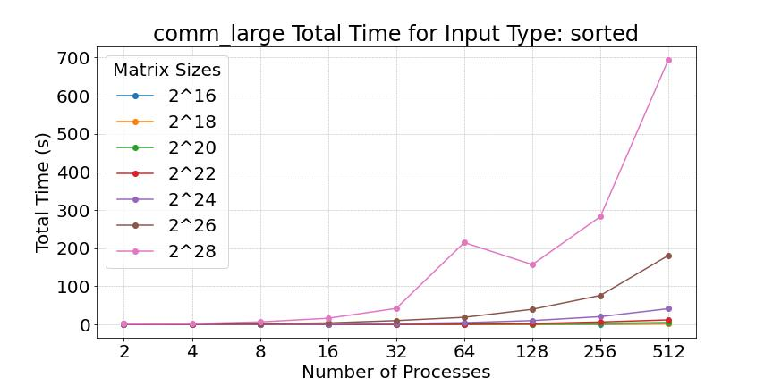
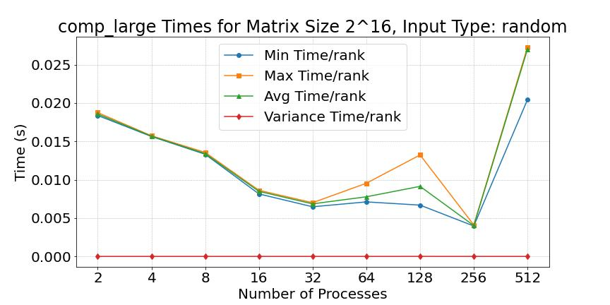
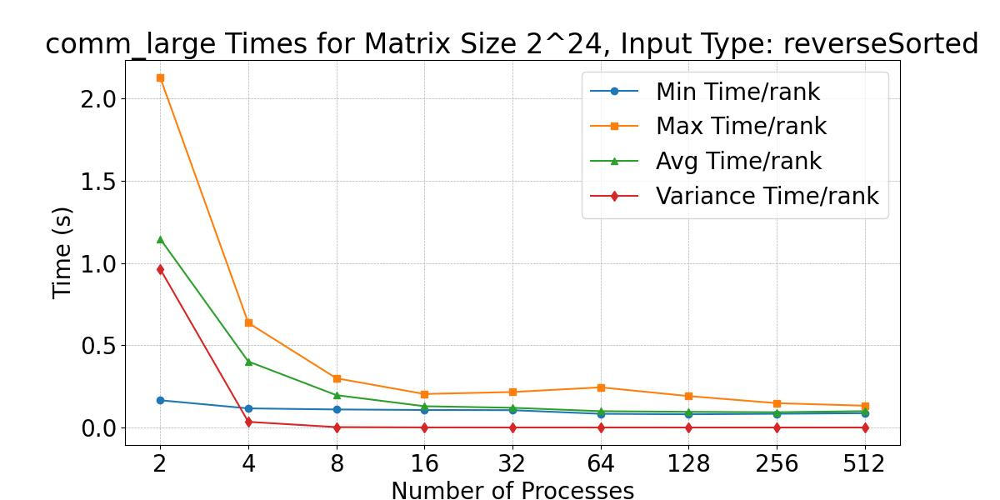
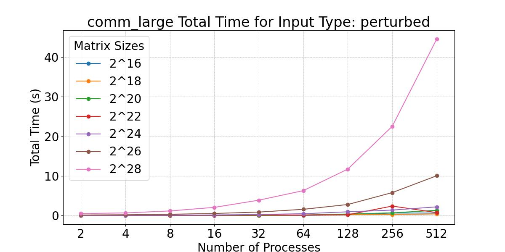
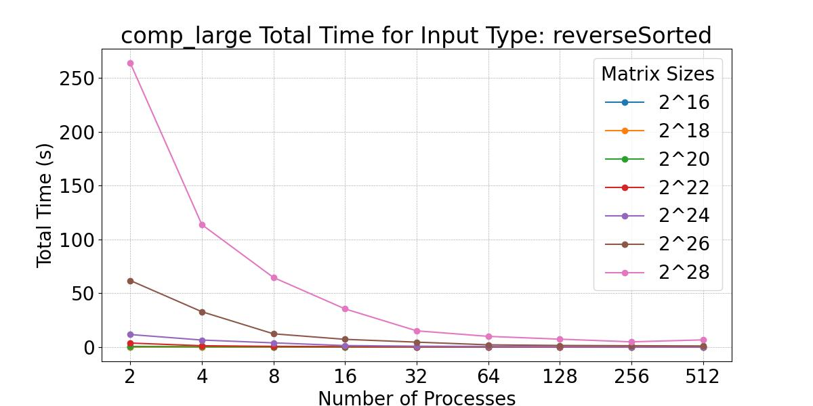
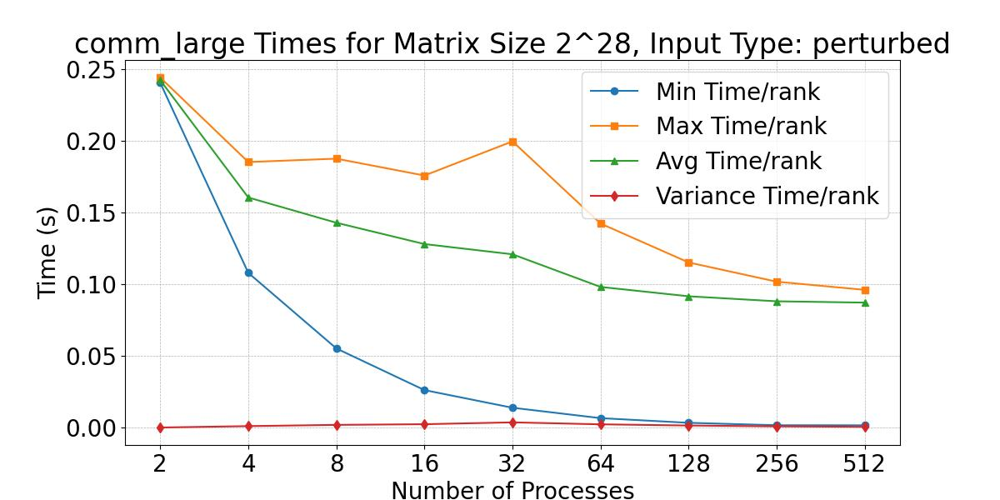

# CSCE 435 Group project

## 0. Group number: 2  

## 1. Group members:
1. First: Aditya Biradar 
2. Second: Eyad Nazir 
3. Third: Eduardo Alvarez Hernandez
4. Fourth: Juan Carrasco 

### 1a. Method of Communication:
- We will use normal phone messaging as our method of coomunication for this project

## 2. Project topic (e.g., parallel sorting algorithms)

- For this project, we will be implementing various sorting algorithms for parallel computing and do a comparitive analysis of the algorithms to identify pros and cons of each algorithm.


### 2a. Brief project description (what algorithms will you be comparing and on what architectures)
- Architecture: For all the algorithms below we will be implementing them with an MPI architecture
- Bitonic Sort (Juan Carrasco): The provided code implements a parallel Bitonic Sort algorithm using MPI for distributed computing. The algorithm begins by ensuring the number of processes is a power of 2 and then distributes the input array among the processes. Each process sorts its local chunk of data, and the algorithm performs a series of comparisons and exchanges between processes to create a bitonic sequence and sort it. The compare_low and compare_high functions handle the comparisons and exchanges to ensure the data is sorted in ascending or descending order, respectively. Finally, the sorted chunks are gathered back to the root process to form the final sorted array. The code also includes Caliper markers for performance profiling. 

- Sample Sort (Eyad Nazir): Sample sort is a parallel sorting algorithm that divides the input array into smaller subarrays, sorts them independently, and merges them back together. The algorithm begins with the root process determining the total number of elements in the input array and broadcasting this information to all processes using `MPI_Bcast`. The input array is then divided into smaller subarrays, which are distributed to different processes using `MPI_Scatterv`. Each process independently sorts its local subarray. Next, each process selects a set of local samples from its sorted subarray, with the number of samples equal to the number of processes minus one. The sizes of these local samples are gathered at the root process using `MPI_Gather`, and the root process then gathers all the local samples from each process using `MPI_Gatherv`. The root process sorts the gathered samples and selects splitters to partition the data, which are then broadcasted to all processes using `MPI_Bcast`. Each process partitions its local subarray based on the splitters, creating buckets of data to be sent to the corresponding processes. The sizes of these buckets are exchanged among all processes using `MPI_Alltoall`, and the data in the buckets is exchanged using `MPI_Alltoallv`. Each process then sorts the data it received from other processes. Finally, the sizes of the sorted subarrays are gathered at the root process using `MPI_Gather`, and the root process gathers all the sorted subarrays from each process using `MPI_Gatherv`. The root process returns the fully sorted array, while other processes return an empty array. This approach leverages the computational power of multiple processes to efficiently sort large datasets in parallel.

- Merge Sort (Aditya Biradar): At its base the merge sort is considered a recursive algorithm, and usually has a runtime of n log(n). In this assignment we will be paralleizing this algorithm. This algorithm implements merge sort using MPI for parallelization to efficiently sort large datasets. It leverages MPI functions like MPI_Scatterv and MPI_Gatherv to handle the distribution of data across processes and the collection of results, ensuring balanced workload and smooth communication. Caliper instrumentation is integrated to measure both communication and computation performance, helping monitor efficiency throughout the sorting process. The input array is divided among processes, with each process performing local sorting using the mergeSort function, which recursively divides the assigned chunk and sorts it with the merge function. This local sorting ensures that each processor handles only a portion of the data, reducing computational overhead. Once all local subarrays are sorted, they are gathered at the root process using MPI_Gatherv. At the root, the multiwayMerge function merges the sorted subarrays using a minimum-heap approach, ensuring optimal performance for merging multiple arrays. Once the multi-way merge completes, the algorithm produces a fully sorted array, achieving parallel efficiency!

- Radix Sort (Eduardo Alvarez Hernandez): Radix sort is a non-comparative sorting algorithm that processes individual digits of the numbers in a given list, sorting them based on place value. The algorithm begins by determining the maximum number of digits in the largest number in the array. This information is used to guide the sorting process. The root process broadcasts the total number of elements in the array to all processes using `MPI_Bcast`. The array is then divided into smaller segments, which are distributed to different processes using `MPI_Scatter`. Each process performs an in-place Most Significant Digit (MSD) radix sort on its local segment. This involves building a histogram for the current digit position, calculating the heads and tails for buckets, and sorting elements in place based on the current digit. The process is repeated recursively for each digit position until the entire segment is sorted. The maximum number of digits is calculated using the `calculateMaxDigits` function, which determines the number of digits in the largest number in the array. Once the local segments are sorted, the sizes of the sorted segments are gathered at the root process using `MPI_Gather`. The root process then gathers all the sorted segments from each process using `MPI_Gatherv`. Finally, the root process performs a final merge step by sorting the gathered segments to produce the fully sorted array. This approach leverages the computational power of multiple processes to efficiently sort large datasets in parallel, with a typical runtime of O(d*(n + k)), where d is the number of digits in the largest number, n is the number of elements, and k is the range of digits.

### 2b. Pseudocode for each parallel algorithm
- For MPI programs, include MPI calls you will use to coordinate between processes

- Bitonic Sort
```python
// Initialize MPI
MPI_Init()

// Get the rank and size of the processes
rank = MPI_Comm_rank(MPI_COMM_WORLD)
P = MPI_Comm_size(MPI_COMM_WORLD)

// Ensure the number of processes is a power of 2
if (P is not a power of 2):
    if (rank == 0):
        print "Number of processes must be a power of 2 for Bitonic sort."
    MPI_Finalize()
    exit(1)

// If the process is the root process (rank 0)
if (rank == 0):
    // Get the size of the input array
    N = size of inputArray

// Broadcast N to all processes
MPI_Bcast(N, 1, MPI_INT, 0, MPI_COMM_WORLD)

// Compute local size and prepare for scattering
base_count = N / P
remainder = N % P
scatterSendCounts = [base_count + (i < remainder ? 1 : 0) for i in 0 to P-1]
scatterSendDispls = [sum(scatterSendCounts[0:i]) for i in 0 to P]

// Scatter the input array to all processes
local_size = scatterSendCounts[rank]
local_data = new array of size local_size
MPI_Scatterv(inputArray, scatterSendCounts, scatterSendDispls, MPI_INT, local_data, local_size, MPI_INT, 0, MPI_COMM_WORLD)

// Sort local data
sort(local_data)

// Bitonic merge network
dimension = log2(P)
for i in 0 to dimension-1:
    for j in i down to 0:
        partner = rank XOR 2^j
        if (partner < 0 or partner >= P):
            continue

        // Send and receive data with partner
        partner_data = new array of size scatterSendCounts[partner]
        MPI_Sendrecv(local_data, local_size, MPI_INT, partner, 0, partner_data, scatterSendCounts[partner], MPI_INT, partner, 0, MPI_COMM_WORLD)

        // Determine sort direction
        ascending = ((rank >> (i + 1)) % 2 == 0)

        // Reverse data if necessary
        if (!ascending):
            reverse(local_data)
            reverse(partner_data)

        // Compare and keep either the lower or upper half based on rank and distance
        if (ascending):
            compare_low(j, local_data, local_size, rank, P)
        else:
            compare_high(j, local_data, local_size, rank, P)

// Gather sorted data back to the root process
sorted_data = new array of size N if rank == 0 else null
MPI_Gatherv(local_data, local_size, MPI_INT, sorted_data, scatterSendCounts, scatterSendDispls, MPI_INT, 0, MPI_COMM_WORLD)

// Finalize MPI
MPI_Finalize()

// Function to compare and swap elements for increasing order
function compare_low(j, local, local_size, rank, size):
    partner = rank XOR 2^j

    // Send local maximum to partner
    MPI_Send(local[local_size - 1], 1, MPI_INT, partner, 0, MPI_COMM_WORLD)

    // Receive min from partner
    min = MPI_Recv(1, MPI_INT, partner, 0, MPI_COMM_WORLD)

    // Initialize send and receive buffers
    buffer_send = new array of size local_size + 1
    buffer_receive = new array of size local_size + 1

    // Fill send buffer with elements greater than min
    send_counter = 0
    for i in local_size - 1 down to 0:
        if (local[i] > min):
            send_counter++
            buffer_send[send_counter] = local[i]
        else:
            break

    buffer_send[0] = send_counter  // First element is the count
    MPI_Send(buffer_send, send_counter + 1, MPI_INT, partner, 0, MPI_COMM_WORLD)

    // Receive buffer from partner
    MPI_Recv(buffer_receive, local_size + 1, MPI_INT, partner, 0, MPI_COMM_WORLD)

    // Merge local data and received buffer
    temp_array = local
    buffer_size = buffer_receive[0]
    k = 1  // Index in buffer_receive
    m = 0  // Index in temp_array

    for i in 0 to local_size - 1:
        if (m < temp_array.size and (k > buffer_size or temp_array[m] <= buffer_receive[k])):
            local[i] = temp_array[m]
            m++
        else if (k <= buffer_size):
            local[i] = buffer_receive[k]
            k++

    // Sort local data
    sort(local)

// Function to compare and swap elements for decreasing order
function compare_high(j, local, local_size, rank, size):
    partner = rank XOR 2^j

    // Receive max from partner
    max = MPI_Recv(1, MPI_INT, partner, 0, MPI_COMM_WORLD)

    // Send local minimum to partner
    MPI_Send(local[0], 1, MPI_INT, partner, 0, MPI_COMM_WORLD)

    // Initialize send and receive buffers
    buffer_send = new array of size local_size + 1
    buffer_receive = new array of size local_size + 1

    // Fill send buffer with elements less than max
    send_counter = 0
    for i in 0 to local_size - 1:
        if (local[i] < max):
            send_counter++
            buffer_send[send_counter] = local[i]
        else:
            break

    MPI_Recv(buffer_receive, local_size + 1, MPI_INT, partner, 0, MPI_COMM_WORLD)

    buffer_send[0] = send_counter
    MPI_Send(buffer_send, send_counter + 1, MPI_INT, partner, 0, MPI_COMM_WORLD)

    // Merge local data and received buffer
    temp_array = local
    buffer_size = buffer_receive[0]
    k = 1
    m = local_size - 1

    for i in local_size - 1 down to 0:
        if (m >= 0 and (k > buffer_size or temp_array[m] >= buffer_receive[k])):
            local[i] = temp_array[m]
            m--
        else if (k <= buffer_size):
            local[i] = buffer_receive[k]
            k++

    // Sort local data
    sort(local)

```
- Sample Sort
```python
function sampleSort():
    # Step 1: Initialize MPI
    MPI.Init()
    rank = MPI.Comm_rank()        # Get process rank
    size = MPI.Comm_size()        # Get number of processes

    # Step 2: Root generates data
    if rank == 0:
        data = generate_data()    # Root generates full data set

    # Step 3: Calculate send counts and displacements (only root)
    if rank == 0:
        base_count = len(data) // size
        remainder = len(data) % size
        send_counts = [base_count + (1 if i < remainder else 0) for i in range(size)]
        send_displs = [sum(send_counts[:i]) for i in range(size)]

    # Step 4: Broadcast send counts
    send_counts = MPI.Bcast(send_counts)

    # Step 5: Allocate space for local data
    local_data = allocate_array(send_counts[rank])  # Each process gets its portion

    # Step 6: Scatter data to all processes
    MPI.Scatterv(data, local_data)

    # Step 7: Sort local data
    local_data.sort()

    # Step 8: Select local samples
    sample_gap = len(local_data) // (size - 1)
    local_samples = [local_data[i * sample_gap] for i in range(1, size)]

    # Step 9: Gather samples at root
    all_samples = MPI.Gather(local_samples)

    # Step 10: Root chooses splitters
    if rank == 0:
        all_samples.sort()
        splitters = [all_samples[i * (size - 1)] for i in range(1, size)]

    # Step 11: Broadcast splitters
    splitters = MPI.Bcast(splitters)

    # Step 12: Partition local data
    partitions = [[] for _ in range(size)]
    for elem in local_data:
        dest = find_partition(splitters, elem)
        partitions[dest].append(elem)

    # Step 13: Exchange partitions
    received_data = MPI.Alltoall(partitions)

    # Step 14: Sort received data
    received_data.sort()

    # Step 15: Gather sorted data at root
    sorted_data = MPI.Gatherv(received_data)

    # Step 16: Print final sorted data (root)
    if rank == 0:
        print(sorted_data)

    # Step 17: Finalize MPI
    MPI.Finalize()

```


- Merge Sort
```python
    MergeSort():
        if((taskid == 0 )):
            //Master Process
            //Split the array into halves proportionate to the number of processors
            split=len(array)//num of processors  **round down to nearest whole number**

            //MPI_SCATTER scatter halves to processors(in)
            master_to_worker=MPI_SCATTER()

            //sort the local chunk in the master
            local_sort= splitter(local_array)

            //MPI Gather call to bring the sorted arrays back into one array 
            worker_to_master=MPI_GATHER()

            //sort the final array from the gather
            final_array=MERGE_SORT(worker_to_master)
            

        if(taskid > 0 ):
            //Recieve the array from the scatter call
            MPI_SCATTER()
            
            //sort the array 
            Splitter(recv array)
            
            // send result back to master
            MPI_GATHER()
            

        Splitter(array):
            If length == 0 || length == 1:
                return array 
            split=len(array)//2 **round down to nearest whole number**
            lhs_array= array[:split]
            rhs_array= array[split:]

            
            lhs_sort=Splitter(lhs_array)
            rhs_sort=Splitter(rhs_array)
            
            return MERGE_SORT(lhs,rhs)

        MERGE_SORT(lhs,rhs):
            sort vector=[]

            while(length of lhs and rhs != 0):
                if lhs[0] < rhs[0]:
                    remove first element from lhs and append to sort
                else:
                    remove first element from rhs and append to sort
            
            if(len(lhs)!=0 and len(rhs)==0):
                append lhs array to sort

            if(len(rhs)!=0 and len(lhs)==0):
                append rhs array to sort
            
            return sort
```
             
- Radix Sort
```python
    Function msd_radix_sort_mpi(data, digit_position, low, high, rank, size, comm):
    If low >= high OR digit_position < 0:
        Return  # Base case: no more sorting needed

    # Step 1: Local histogram creation
    Initialize local_histogram[10] = {0}
    For i from low to high:
        local_histogram[get_digit(data[i], digit_position)] += 1

    # Step 2: Global histogram (MPI Reduce)
    Initialize global_histogram[10] = {0}
    MPI_Reduce(local_histogram, global_histogram, SUM, root = 0)

    # Step 3: Compute bucket positions (root process) and broadcast
    If rank == 0:
        cumulative_sum[0] = 0
        For i from 1 to 9:
            cumulative_sum[i] = cumulative_sum[i-1] + global_histogram[i-1]
    MPI_Bcast(cumulative_sum, root = 0)

    # Step 4: In-place bucket sorting
    i = low
    While i <= high:
        digit = get_digit(data[i], digit_position)
        correct_pos = cumulative_sum[digit]
        If i >= correct_pos AND i < correct_pos + global_histogram[digit]:
            i += 1
        Else:
            Swap data[i] with data[correct_pos]
            cumulative_sum[digit] += 1

    # Step 5: Recursively sort each bucket
    For digit from 0 to 9:
        next_start = cumulative_sum[digit] - global_histogram[digit]
        next_end = cumulative_sum[digit] - 1
        If next_start < next_end:
            msd_radix_sort_mpi(data, digit_position - 1, next_start, next_end, rank, size, comm)


# Main function to initialize MPI and distribute the data
Function parallel_msd_radix_sort(data):
    MPI_Init()
    rank = MPI_Comm_rank(MPI_COMM_WORLD)
    size = MPI_Comm_size(MPI_COMM_WORLD)

    # Step 1: Scatter data across processors
    local_data_size = len(data) // size
    if rank == 0:
        local_data = np.array_split(data, size)
    else:
        local_data = None
    local_data = comm.scatter(local_data, root=0)

    # Step 2: Apply the MSD Radix Sort on the local data
    max_digit_position = get_max_digit_position(data)  # Find max digit length
    msd_radix_sort_mpi(local_data, max_digit_position, 0, len(local_data) - 1, rank, size, comm)

    # Step 3: Gather sorted subarrays back to root
    sorted_data = comm.gather(local_data, root=0)

    if rank == 0:
        # Merge the results from all processors
        return np.concatenate(sorted_data)
    
```


### 2c. Evaluation plan - what and how will you measure and compare
- Input sizes, Input types:
  - For our input sizes, we will start from a small n size for our array and then progressively make it larger.
  - Input sizes: \(2^{16}\), \(2^{18}\), \(2^{20}\), \(2^{22}\), \(2^{24}\), \(2^{26}\), \(2^{28}\)
  - Input types:
    - Sorted arrays
    - Reverse sorted arrays
    - Random arrays
    - 1% perturbed
- Strong scaling (same problem size, increase number of processors/nodes):
  - With this measurement, this could show diminishing returns as we try to find the optimized amount of processors for a given problem.
  - Number of processors/nodes: 2, 4, 8, 32, 64, 128, 256, 512, 1024

- Weak scaling (increase problem size, increase number of processors):
  - With this measurement, we could find the limit on each processor and how long it takes for something to compute among those algorithms.
  - Number of processors/nodes: 2, 4, 8, 32, 64, 128, 256, 512, 1024

- Run time():
  - With this measurement, we can compare the run times and although some algorithms inherently may be quicker than others, it's still good to compare to see how much extra time a certain algorithm could take to understand the costs associated with a given algorithm.


### 3a. Caliper instrumentation
Please use the caliper build `/scratch/group/csce435-f24/Caliper/caliper/share/cmake/caliper` 
(same as lab2 build.sh) to collect caliper files for each experiment you run.

Your Caliper annotations should result in the following calltree
(use `Thicket.tree()` to see the calltree):
```
main
|_ data_init_X      # X = runtime OR io
|_ comm
|    |_ comm_small
|    |_ comm_large
|_ comp
|    |_ comp_small
|    |_ comp_large
|_ correctness_check
```

Required region annotations:
- `main` - top-level main function.
    - `data_init_X` - the function where input data is generated or read in from file. Use *data_init_runtime* if you are generating the data during the program, and *data_init_io* if you are reading the data from a file.
    - `correctness_check` - function for checking the correctness of the algorithm output (e.g., checking if the resulting data is sorted).
    - `comm` - All communication-related functions in your algorithm should be nested under the `comm` region.
      - Inside the `comm` region, you should create regions to indicate how much data you are communicating (i.e., `comm_small` if you are sending or broadcasting a few values, `comm_large` if you are sending all of your local values).
      - Notice that auxillary functions like MPI_init are not under here.
    - `comp` - All computation functions within your algorithm should be nested under the `comp` region.
      - Inside the `comp` region, you should create regions to indicate how much data you are computing on (i.e., `comp_small` if you are sorting a few values like the splitters, `comp_large` if you are sorting values in the array).
      - Notice that auxillary functions like data_init are not under here.
    - `MPI_X` - You will also see MPI regions in the calltree if using the appropriate MPI profiling configuration (see **Builds/**). Examples shown below.

All functions will be called from `main` and most will be grouped under either `comm` or `comp` regions, representing communication and computation, respectively. You should be timing as many significant functions in your code as possible. **Do not** time print statements or other insignificant operations that may skew the performance measurements.

### **Nesting Code Regions Example** - all computation code regions should be nested in the "comp" parent code region as following:
```
CALI_MARK_BEGIN("comp");
CALI_MARK_BEGIN("comp_small");
sort_pivots(pivot_arr);
CALI_MARK_END("comp_small");
CALI_MARK_END("comp");

# Other non-computation code
...

CALI_MARK_BEGIN("comp");
CALI_MARK_BEGIN("comp_large");
sort_values(arr);
CALI_MARK_END("comp_large");
CALI_MARK_END("comp");
```

### **Calltree Example**:
```
# MPI Mergesort
4.695 main
├─ 0.001 MPI_Comm_dup
├─ 0.000 MPI_Finalize
├─ 0.000 MPI_Finalized
├─ 0.000 MPI_Init
├─ 0.000 MPI_Initialized
├─ 2.599 comm
│  ├─ 2.572 MPI_Barrier
│  └─ 0.027 comm_large
│     ├─ 0.011 MPI_Gather
│     └─ 0.016 MPI_Scatter
├─ 0.910 comp
│  └─ 0.909 comp_large
├─ 0.201 data_init_runtime
└─ 0.440 correctness_check
```

### **Calltrees**:


## **Merge Sort**:
```
203.481 main
├─ 0.000 MPI_Init
├─ 0.000 MPI_Comm_rank
├─ 0.000 MPI_Comm_size
├─ 7.895 data_init_runtime
│  └─ 0.859 MPI_Gatherv
├─ 1.012 comm
│  ├─ 0.078 comm_small
│  │  └─ 0.078 MPI_Bcast
│  └─ 0.934 comm_large
│     ├─ 0.134 MPI_Scatterv
│     └─ 0.800 MPI_Gatherv
├─ 99.080 comp
│  └─ 99.080 comp_large
├─ 94.625 correctness_check
│  ├─ 93.918 MPI_Bcast
│  ├─ 0.124 MPI_Scatterv
│  ├─ 0.000 MPI_Send
│  ├─ 0.046 MPI_Recv
│  └─ 0.022 MPI_Allreduce
├─ 0.000 MPI_Finalize
├─ 0.000 MPI_Initialized
├─ 0.000 MPI_Finalized
└─ 0.001 MPI_Comm_dup


```

## **Sample Sort**:
```
107.894 main
├─ 0.000 MPI_Init
├─ 0.000 MPI_Comm_rank
├─ 0.000 MPI_Comm_size
├─ 7.903 data_init_runtime
│  └─ 0.875 MPI_Gatherv
├─ 10.786 comm
│  ├─ 0.171 comm_small
│  │  ├─ 0.080 MPI_Bcast
│  │  ├─ 0.007 MPI_Gather
│  │  └─ 0.083 MPI_Gatherv
│  └─ 10.615 comm_large
│     ├─ 0.130 MPI_Scatterv
│     ├─ 0.044 MPI_Alltoall
│     ├─ 0.086 MPI_Alltoallv
│     ├─ 2.965 MPI_Gather
│     └─ 6.749 MPI_Gatherv
├─ 87.876 comp
│  ├─ 80.293 comp_large
│  └─ 7.583 comp_small
├─ 0.765 correctness_check
│  ├─ 0.047 MPI_Bcast
│  ├─ 0.127 MPI_Scatterv
│  ├─ 0.000 MPI_Send
│  ├─ 0.030 MPI_Recv
│  └─ 0.028 MPI_Allreduce
├─ 0.000 MPI_Finalize
├─ 0.000 MPI_Initialized
├─ 0.000 MPI_Finalized
└─ 0.001 MPI_Comm_dup

```

## **Radix Sort**:
```
306.792 main
├─ 0.000 MPI_Init
├─ 0.000 MPI_Comm_rank
├─ 0.000 MPI_Comm_size
├─ 7.997 data_init_runtime
│  └─ 0.856 MPI_Gatherv
├─ 0.242 comm
│  ├─ 0.077 comm_small
│  │  └─ 0.077 MPI_Bcast
│  └─ 0.165 comm_large
│     └─ 0.165 MPI_Scatter
├─ 74.423 comp
│  ├─ 35.560 comp_large
│  └─ 38.863 comp_small
│     └─ 0.180 MPI_Gather
├─ 223.581 correctness_check
│  ├─ 222.862 MPI_Bcast
│  ├─ 0.128 MPI_Scatterv
│  ├─ 0.000 MPI_Send
│  ├─ 0.046 MPI_Recv
│  └─ 0.027 MPI_Allreduce
├─ 0.000 MPI_Finalize
├─ 0.000 MPI_Initialized
├─ 0.000 MPI_Finalized
└─ 0.001 MPI_Comm_dup
```

## **Bitonic Sort**:
```
116.515 main
├─ 0.000 MPI_Init
├─ 0.000 MPI_Comm_rank
├─ 0.000 MPI_Comm_size
├─ 7.969 data_init_runtime
│  └─ 0.895 MPI_Gatherv
├─ 1.142 comm
│  ├─ 0.081 comm_small
│  │  └─ 0.081 MPI_Bcast
│  └─ 1.061 comm_large
│     ├─ 0.131 MPI_Scatterv
│     └─ 0.930 MPI_Gatherv
├─ 105.875 comp
│  └─ 105.875 comp_large
│     ├─ 0.125 MPI_Send
│     └─ 0.647 MPI_Recv
├─ 0.754 correctness_check
│  ├─ 0.049 MPI_Bcast
│  ├─ 0.131 MPI_Scatterv
│  ├─ 0.000 MPI_Send
│  ├─ 0.027 MPI_Recv
│  └─ 0.028 MPI_Allreduce
├─ 0.000 MPI_Finalize
├─ 0.000 MPI_Initialized
├─ 0.000 MPI_Finalized
└─ 0.001 MPI_Comm_dup
```

### 3b. Collect Metadata

Have the following code in your programs to collect metadata:
```
adiak::init(NULL);
adiak::launchdate();    // launch date of the job
adiak::libraries();     // Libraries used
adiak::cmdline();       // Command line used to launch the job
adiak::clustername();   // Name of the cluster
adiak::value("algorithm", algorithm); // The name of the algorithm you are using (e.g., "merge", "bitonic")
adiak::value("programming_model", programming_model); // e.g. "mpi"
adiak::value("data_type", data_type); // The datatype of input elements (e.g., double, int, float)
adiak::value("size_of_data_type", size_of_data_type); // sizeof(datatype) of input elements in bytes (e.g., 1, 2, 4)
adiak::value("input_size", input_size); // The number of elements in input dataset (1000)
adiak::value("input_type", input_type); // For sorting, this would be choices: ("Sorted", "ReverseSorted", "Random", "1_perc_perturbed")
adiak::value("num_procs", num_procs); // The number of processors (MPI ranks)
adiak::value("scalability", scalability); // The scalability of your algorithm. choices: ("strong", "weak")
adiak::value("group_num", group_number); // The number of your group (integer, e.g., 1, 10)
adiak::value("implementation_source", implementation_source); // Where you got the source code of your algorithm. choices: ("online", "ai", "handwritten").
```

They will show up in the `Thicket.metadata` if the caliper file is read into Thicket.

For the metadata the launch dates will be varying for everyone on the team. The cluster is the grace cluster. the algorithm we are collecting data are merge , sample, bitonic and radix sort. The programming model is mpi. the input size we used for this submission is 2^28 and input type was random. The number of processors was 4. For scalibility we are testing strong and weak. We are group 2. For implementation_source it was a combination of handwritten, online, and ai.

### **See the `Builds/` directory to find the correct Caliper configurations to get the performance metrics.** They will show up in the `Thicket.dataframe` when the Caliper file is read into Thicket.

## 4. Performance evaluation


Include detailed analysis of computation performance, communication performance. 
Include figures and explanation of your analysis.


### 4a. Vary the following parameters
For input_size's:
- 2^16, 2^18, 2^20, 2^22, 2^24, 2^26, 2^28


For input_type's:
- Sorted, Random, Reverse sorted, 1%perturbed


MPI: num_procs:
- 2, 4, 8, 16, 32, 64, 128, 256, 512, 1024


This should result in 4x7x10=280 Caliper files for your MPI experiments.


### 4b. Hints for performance analysis


To automate running a set of experiments, parameterize your program.


- input_type: "Sorted" could generate a sorted input to pass into your algorithms
- algorithm: You can have a switch statement that calls the different algorithms and sets the Adiak variables accordingly
- num_procs: How many MPI ranks you are using


When your program works with these parameters, you can write a shell script 
that will run a for loop over the parameters above (e.g., on 64 processors, 
perform runs that invoke algorithm2 for Sorted, ReverseSorted, and Random data).  


### 4c. You should measure the following performance metrics
- `Time`
    - Min time/rank
    - Max time/rank
    - Avg time/rank
    - Total time
    - Variance time/rank

#######################################Performance Evaluation ##########################################
## **Merge Sort**:

## **Bitonic Sort**:
### Computation Large (Total Time)
<p float="left">
  
  
</p>
<p float="left">
  
  
</p>

Above we can see 4 Total Computation Time vs Number of Processes plots for each data input type: Perturbed, Random, Sorted, and Reverse Sorted. These graphs are good examples of both **strong scaling** as we can observe how the parallel bitonic sorting algorithm performs with an increasing number of processors for each of the input sizes, and **weak scaling** when we observe each data point for the different input sizes across the number of processors.

In **strong scaling**, where we analyze the performance with increasing processor counts for fixed input sizes, the parallel bitonic sorting algorithm shows:

- Smaller Input Sizes (2<sup>16</sup> to 2<sup>24</sup>): The total computation time remains fairly consistent across increasing processor counts, suggesting that for smaller inputs, parallelization provides diminishing returns due to overhead like communication and synchronization costs.
- Larger Input Sizes (2<sup>26</sup> and 2<sup>28</sup>): Computation time increases more sharply as the number of processors grows. Larger datasets incur more computational work and are more sensitive to parallelization inefficiencies, particularly visible in the perturbed and random inputs.

In **weak scaling**, where both the input size and processor count grow proportionally, the total computation time ideally should remain constant:

- Smaller Input Sizes (2<sup>16</sup> to 2<sup>20</sup>): The computation time remains relatively constant, indicating that the algorithm scales well with increasing processors for smaller datasets.
- Larger Input Sizes (2<sup>24</sup> and above): There is a noticeable increase in computation time, especially with 128+ processors, indicating that weak scaling becomes less efficient for large inputs, likely due to overhead like communication and data distribution inefficiencies across processors.

These trends are consistent across the different input types, except for a small peak in the Sorted input type when 64 processes are allocated for sorting an already sorted array. Both scaling types reveal that smaller inputs benefit more from parallelization, while larger inputs face performance bottlenecks as processor counts increase, particularly in the sorted and reverse-sorted input types.

### Communication Large (Total Time)
<p float="left">
  
  
</p>
<p float="left">
  
  
</p>

The four plots provided illustrate the Large Total Communication Time versus the number of processors for each data input type: Perturbed, Random, Sorted, and Reverse Sorted. The large communication time in this context refers to the time taken by MPI signals (such as MPI_Scatterv and MPI_Gatherv) to communicate data between the processors during the parallel execution of the bitonic sort algorithm.

In **strong scaling**, where the input size is fixed, and the number of processors increases:

- Smaller Input Sizes (2<sup>16</sup> to 2<sup>24</sup>): Across all input types (perturbed, random, sorted, and reverse sorted), communication times remain minimal at lower processor counts (up to 64 processors). However, as the number of processors increases (beyond 128), there is a slight rise, and at 512 processors, communication time starts growing more noticeably.
- Larger Input Sizes (2<sup>26</sup> and 2<sup>28</sup>): For larger input sizes, communication time increases rapidly, especially after 128 processors. The rise becomes steepest at 512 processors, reflecting the significant communication overhead when distributing and collecting data across many processors. This increase is consistent across all input types.

In **weak scaling**, where both the input size and processor count increase proportionally:

- Smaller Input Sizes (2<sup>16</sup> to 2<sup>20</sup>): Communication times remain relatively constant as the processor count increases, indicating good weak scaling performance. The MPI communication overhead does not significantly impact performance for small datasets.
- Larger Input Sizes (2<sup>24</sup> to 2<sup>28</sup>): Communication times increase notably with larger input sizes, especially beyond 64 processors. For 2<sup>28</sup>, the communication cost rises sharply at 256 and 512 processors, signaling that weak scaling becomes less efficient as both the dataset size and processor count increase, with MPI communication becoming a significant bottleneck.

Across all input types and sizes, communication overhead becomes more apparent as processor count and data size increase, suggesting room for optimization in the MPI communication methods used in the parallel bitonic sorting algorithm.

### Computation Large (Min, Max, Avg., Variance)
<p float="left">
  
  
</p>
<p float="left">
  
  
</p>
The analysis of the computation time plots (min, max, average, and variance) across varying matrix sizes and processor counts highlights how the parallel bitonic sort algorithm scales with both strong and weak scaling approaches. For smaller matrix sizes, such as 2<sup>16</sup>, the algorithm shows strong scaling up to 128 processors. However, beyond that, particularly at 256 and 512 processors, there is an increase in both average and maximum times, indicating inefficiencies likely caused by communication overhead and synchronization costs. This suggests that for small datasets, adding more processors does not yield further performance benefits and can, in fact, degrade performance due to overhead.

For larger matrix sizes like 2<sup>20</sup>, 2<sup>24</sup>, and 2<sup>28</sup>, the algorithm demonstrates better strong scaling. The average and maximum times decrease smoothly as the number of processors increases, with no significant jumps or inefficiencies, even at 512 processors. This shows that the algorithm can efficiently handle larger datasets by distributing the computational workload across more processors. Importantly, the variance in computation times remains close to zero across all processor counts, indicating that the workload is evenly balanced among the processors, which is crucial for maintaining efficiency in a parallel system.

In terms of weak scaling, where both input size and processor count increase proportionally, the algorithm performs well. Across all matrix sizes, the average and maximum times per processor steadily decrease with more processors, and the variance remains minimal, reflecting good load balancing. For larger input sizes like 2<sup>28</sup>, although the absolute computation time is higher due to the size of the data, the system effectively reduces the per-rank computation time as processors are added.

In summary, the parallel bitonic sorting algorithm scales effectively for large datasets with minimal variance in computation times across processors, reflecting a well-balanced workload distribution. However, for smaller datasets, adding too many processors introduces inefficiencies, particularly at higher processor counts, due to communication overhead.

### Data generation and Correctness check (Min, Max, Avg., Variance)
<p float="left">
  
  
</p>
<p float="left">
  
  
</p>

The plots above show the time it takes for generating a reverse sorted array in a parallel manner, as well as the time it takes for checking that the array is sorted (in a parallel manner too).

The analysis of data generation and correctness check times for reverse-sorted input arrays highlights generally good scaling performance, especially for larger matrix sizes. When generating the reverse-sorted arrays in parallel, the system shows smooth and efficient scaling for larger datasets like 2<sup>28</sup>. In these cases, both average and maximum times per processor decrease as more processors are added, reflecting good use of parallelism. However, for smaller datasets like 2<sup>18</sup>, there’s a noticeable spike in time at 64 processors, likely due to inefficiencies in how the data is distributed or synchronized at that point. Beyond this, the times level out, indicating that the system adjusts and scales more effectively with larger numbers of processors.

The correctness check, which ensures the array has been sorted properly, also performs well for the most part. Larger datasets scale consistently, while smaller datasets show minor inefficiencies, particularly at 64 processors, where there’s a slight increase in both the maximum time and variance. These small spikes are probably due to communication overhead or synchronization delays as the system checks the sorted array in parallel.

Despite these occasional hiccups with smaller datasets, the parallel algorithm generally manages both data generation and correctness checking efficiently. The low variance across all processor counts suggests that the workload is well balanced, which is key for maintaining performance in a parallel environment.

## **Sample Sort**:
### Communication Large (Total Time)
<p float="left">
  
  
</p>
<p float="left">
  
  
</p>

In these graphs, **strong scaling** (same problem size, increasing processors) performs well up to 64-128 processes, particularly for smaller matrix sizes like 2<sup>16</sup> and 2<sup>18</sup>. Beyond 128 processes, the communication overhead in the `comm_large` region becomes significant, causing total time to increase, especially for larger matrices like 2<sup>28</sup>. This shows that while strong scaling is effective up to a certain point, the overhead from adding more processes starts to outweigh the benefits for larger problems.

For **weak scaling** (increasing both problem size and processors), the total time grows noticeably as matrix sizes and process counts rise, particularly when reaching 256-512 processes. Ideally, weak scaling should maintain constant total time, but here, larger matrices like 2<sup>28</sup> see steep increases, showing inefficiency. This is because communication overhead becomes a limiting factor, as more data needs to be exchanged between a growing number of processes. Overall, the algorithm scales better under strong scaling, while weak scaling struggles with high communication costs at larger scales.

### Computation Large (Total Time)

<p float="left">
  
  
</p>
<p float="left">
  
  
</p>

In these graphs, we observe that the total computation time for large data sets `comp_large` varies based on input type and reflects differences in **strong** and **weak scaling**.

For **strong scaling** (same problem size, more processes), **random** and **sorted** inputs show good performance, with computation time decreasing as the number of processes increases, indicating efficient partitioning and workload distribution. Even for large matrices like 2^28, increasing processes reduces computation time. In contrast, **perturbed** and **reverse sorted** inputs show poor strong scaling, with computation times remaining high or even increasing as more processes are added, due to imbalanced partitioning.

For **weak scaling** (increasing both problem size and processes), **random** and **sorted** inputs continue to scale better, while **perturbed** and **reverse sorted** inputs struggle. As the problem size and number of processes increase, these irregular inputs result in inefficient data distribution, limiting the benefits of additional processes.

### Communication Large (Min, Max, Avg., Variance)

<p float="left">
  
  
</p>
<p float="left">
  
  
</p>

These graphs highlight **strong scaling**, where the problem size remains constant as the number of processes increases. For all matrix sizes, there’s a spike in communication time at 4 processes, particularly for larger matrices like 2<sup>28</sup>, due to fewer processes handling large workloads. As more processes are added, communication times drop and stabilize, showing effective strong scaling for larger matrices like 2<sup>28</sup> and 2<sup>24</sup>, with both time and variance per rank decreasing.

However, 2<sup>20</sup> shows irregular results, with communication times fluctuating more noticeably as the number of processes increases, especially beyond 64 processes. This irregularity suggests that adding more processes for smaller problem sizes leads to inconsistent scaling due to communication overhead. Overall, strong scaling is effective for larger matrices, while smaller matrices like 2<sup>16</sup> and 2<sup>20</sup> experience less predictable improvements, with 2<sup>20</sup> showing the most irregular scaling behavior.

### Data generation and Correctness check (Min, Max, Avg., Variance)
<p float="left">
  
  
</p>
<p float="left">
  
  
</p>

For the **correctness check** times with matrix sizes 2<sup>18</sup> and 2<sup>28</sup> using reverse sorted input, the results show a general decrease in time as the number of processes increases, though with some fluctuations. In 2<sup>18</sup>, there’s a notable spike at 64 processes where maximum times increase sharply before stabilizing as more processes are added, suggesting inefficiencies in communication at that point. In contrast, 2<sup>28</sup> demonstrates a smoother decline in times, with a sharp drop from 2 to 4 processes and steady times afterward, indicating good strong scaling for larger matrices.

In the **data initialization** times, 2<sup>18</sup> shows stable and low times until the process count exceeds 128, after which there is a dramatic spike at 512 processes, reflecting inefficiency at higher process counts for smaller matrices. For 2<sup>28</sup>, the initialization time decreases steadily with more processes, especially from 2 to 8 processes, before leveling off. This demonstrates strong scaling for larger matrices, with minimal variance and balanced workload distribution as processes increase.

## **Radix Sort**:

### Note:
During the generation of the Radix Sort graphs, some issues were encountered with the `2^16` caliper files when processing random inputs. As a result, certain graphs appear cropped and may not include data for `2^16` in some instances. This problem affected the completeness of the visualizations, leading to the omission of `2^16` in some cases.

### Communication Large (Total Time)
<p float="left">
  
  
</p>
<p float="left">
  
  
</p>

The graphs show the communication time across multiple processes for different matrix sizes (`2^16` to `2^28`) and input types (perturbed, random, sorted, reverse sorted). Communication time increases as the number of processes rises, especially for larger matrices (`2^28`, `2^26`), where the sharpest increase occurs beyond 128 processes. Smaller matrices (`2^16`, `2^18`) have minimal communication overhead. Overall, while parallelization improves computation time, communication overhead grows significantly with larger data sets and higher process counts, indicating diminishing returns beyond a certain number of processes due to the increased communication cost.


### Computation Large (Total Time)
<p float="left">
  
  
</p>
<p float="left">
  
  
</p>

The graphs illustrate the total computation time for different matrix sizes (`2^16` to `2^28`) and input types (perturbed, random, sorted, reverse sorted) as the number of processes increases from 2 to 512. Across all input types and matrix sizes, there is a clear trend of decreasing computation time with increasing processes, particularly for larger matrices like `2^24`, `2^26`, and `2^28`. These large matrices see a sharp reduction in time as the number of processes increases up to around 64, beyond which further reductions are minimal, indicating diminishing returns. For smaller matrices (`2^16`), while there is some improvement, the gains are much less pronounced due to the relatively small problem size. The input types do not significantly impact the general trend, though larger matrices consistently show the most benefit from parallelization across all input types. Overall, the RadixSort implementation demonstrates **strong scalability** for large matrix sizes, with the most significant improvements occurring as the number of processes increases up to around 64, after which the performance gains taper off.


### Computation Large (Min, Max, Avg., Variance)
<p float="left">
  
  
</p>
<p float="left">
  
  
</p>

The graphs depict performance metrics for a parallel RadixSort implementation across different matrix sizes (`2^16`, `2^20`, `2^24`, `2^28`) and various numbers of processes. The metrics include the minimum, maximum, average, and variance in time per rank. For smaller matrices (`2^16` and `2^20`), there is a noticeable spike in max time per rank when using intermediate process counts (e.g., 64 and 128 processes), indicating load imbalance and communication overhead. 

This suggests that **weak scaling** is less efficient for these sizes, as the increase in processes does not proportionally improve performance. In contrast, for larger matrices (`2^24` and `2^28`), all time metrics generally decrease as more processes are added, demonstrating better scalability and distribution of the workload, which reflects **strong scaling**. Larger matrices particularly benefit from higher process counts, as seen by the sharp reductions in time per rank, indicating that the parallel RadixSort implementation scales well in both strong and weak scaling scenarios when matrix sizes are large. However, for smaller matrices, the algorithm struggles to fully capitalize on the increased number of processes, likely due to the overhead outweighing the benefits.

### Data generation and Correctness check (Min, Max, Avg., Variance)

<p float="left">
  
  
</p>
<p float="left">
  
  
</p>

The graphs depict performance metrics (Min, Max, Avg, and Variance of time per rank) for data generation and correctness check in a parallel system, across different matrix sizes (`2^18`, `2^28`) and varying numbers of processes. For larger matrices like `2^28`, as the number of processes increases, the time metrics (Min, Max, Avg) decrease significantly up to around 64 processes, after which they level off. 

This indicates that parallelization is effective up to a certain number of processes, beyond which the benefit diminishes. The variance remains low across most of the graphs, showing that the workload is distributed fairly evenly across the processes, except for minor spikes in some cases (e.g., for `2^18` with 128 or 512 processes), which may suggest occasional load imbalances or communication overhead. Overall, parallelization provides clear time reduction, especially for larger matrices, but the returns diminish as the number of processes increases, highlighting a balance between computation time and communication overhead.

##########################################################################################################


## 5. Presentation
Plots for the presentation should be as follows:
- For each implementation:
    - For each of comp_large, comm, and main:
        - Strong scaling plots for each input_size with lines for input_type (7 plots - 4 lines each)
        - Strong scaling speedup plot for each input_type (4 plots)
        - Weak scaling plots for each input_type (4 plots)


Analyze these plots and choose a subset to present and explain in your presentation.


## 6. Final Report
Submit a zip named `TeamX.zip` where `X` is your team number. The zip should contain the following files:
- Algorithms: Directory of source code of your algorithms.
- Data: All `.cali` files used to generate the plots seperated by algorithm/implementation.
- Jupyter notebook: The Jupyter notebook(s) used to generate the plots for the report.
- Report.md
